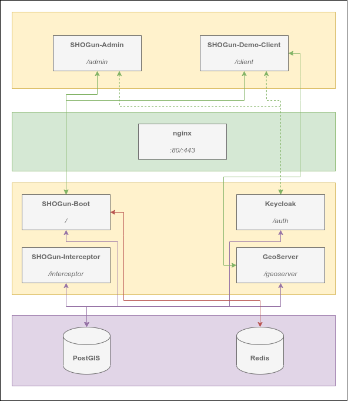

# SHOGun-Boot Docker

This project contains a basic docker-compose setup required to develop / run a
[SHOGun-Boot](https://github.com/terrestris/shogun) webapplication.

## Description 📙

This repository contains several `docker-compose` configuration files:

- `common-services.yml`: Contains the shared service configurations for all environments.
- `docker-compose.yml`: Contains the service configurations for DEVELOPMENT.
- `docker-compose-prod.yml`: Contains the service configurations for PRODUCTION.

## Requirements 🛠️

- docker
- docker-compose-plugin

Please note: If you want to develop SHOGun or some of it's components you might need
additional tools (e.g. `mvn` and `node`). Consider the README files of the associated
repositories for more details.

## System architecture



## Development 🧑‍💻

This repository contains the required configurations to develop all SHOGun related
components:

- SHOGun (the backend part)
- SHOGun-Admin (the UI for handling SHOGun entities)
- SHOGun-GIS-Client (the default mapping client)

### Recommended directory structure

To get things started, please check out all required repositories in the recommended
directory structure:

```bash
your-shogun-workspace-directory/
├── shogun (https://github.com/terrestris/shogun)
├── shogun-admin (https://github.com/terrestris/shogun-admin)
├── shogun-gis-client (https://github.com/terrestris/shogun-gis-client)
└── shogun-docker (this repository)
```

### Required steps for the very first start

- Check and fulfill all development notes of the child components (e.g. installing the
  `maven` and `node` dependencies).
- Set all required environment variables (and create a local SSL certificate) by executing `./setEnvironment.sh create` (and adjusting the values if needed).
- Import the initial Keycloak data, see section [Keycloak Import](#import).

### Startup

Please ensure you have checked out all required repositores (see [Recommended directory structure](#recommended-directory-structure))
and have fulfilled the required steps for the very first start (see [Required steps for the very first start](#required-steps-for-the-very-first-start)).

To start the services required for development of SHOGun (no custom project), just run:

```bash
docker compose up --build
```

You can test whether the SHOGun application started by visiting the URL `https://localhost/`.

### Custom project development

The contents of this repository may be a good starting point for creating a custom project
based on [SHOGun](https://github.com/terrestris/shogun).

There is a SHOGun example app repository at [https://github.com/terrestris/shogun-example-app](https://github.com/terrestris/shogun-example-app) which demonstrates on how SHOGun can be extended for custom implementations and can be used as follows:

1. Create a new folder directory as suggested:

```bash
your-custom-shogun-workspace-directory/
├── shogun-example-app (export of https://github.com/terrestris/shogun-example-app)
└── shogun-example-docker (export of this repository)
```

1. Initialize git in both subdirectories (`git init`) and adjust the upstream to your
   needs (e.g. `git remote add upstream git@github.com:yourorg/shogun-example.git`).

1. (Optional) Make use of the prebuilt images for both the `shogun-admin` and `shogun-gis-client`
   by adjusting the `docker-compose.yml`:

    ```diff
    -    build:
    -      context: ${SHOGUN_ADMIN_DIR}
    -      dockerfile: Dockerfile.dev
    -    volumes:
    -      - ${SHOGUN_ADMIN_DIR}:/app
    +    image: docker-public.terrestris.de/terrestris/shogun-admin:13.0.1
    ```

    ```diff
    -    build:
    -      context: ${SHOGUN_CLIENT_DIR}
    -      dockerfile: Dockerfile.dev
    -    volumes:
    -      - ${SHOGUN_CLIENT_DIR}:/app
    +    image: docker-public.terrestris.de/terrestris/shogun-gis-client:7.3.1
    ```

1. Remove the `shogun-gs-interceptor` service from the `docker-compose.yml`.

1. Update the context path to the `shogun-boot` service:

    ```diff
    -    context: ${SHOGUN_DIR}/shogun-boot/
    +    context: ${SHOGUN_DIR}/example-backend/
    ```

1. Check for all comments _TODO: Adjust to your project_ in the `shogun-example-app` and
   adjust the appropriate lines to your needs (e.g. the name of the project).

1. Set all required environment variables by executing `./setEnvironment.sh create` (and adjusting the values if needed).

1. Depending on the mode (development or production) of the `shogun-admin` and `shogun-gis-client`,
   you might need to adjust the reverse proxy settings in the `shogun-nginx/dev/default.conf` file, e.g.:

    ```diff
    -    proxy_pass http://shogun-admin:8080/;
    +    proxy_pass http://shogun-admin/;
    ```
    ```diff
    -    proxy_pass http://shogun-client:8080/;
    +    proxy_pass http://shogun-client/;
    ```

1. Run the services with `docker compose up` which should be available at `https://localhost/` afterwards.

1. Import the initial Keycloak data, see section [Keycloak Import](#import).

## Test a prebuilt SHOGun 🏭

You want to see SHOGun in action?

- Set all required environment variables by executing `./setEnvironment.sh create` (and adjusting the values if needed).
- Import the initial Keycloak data, see section [Keycloak Import](#import).

And start the prebuilt images via:

```bash
docker compose -f docker-compose-prod.yml up
```

You can test whether the SHOGun application started by visiting the URL
`https://localhost/`.

## Default credentials 🔐

- Keycloak Admin: `admin:shogun`
- SHOGun Admin: `shogun:shogun`
- GeoServer: `admin:geoserver`

## PostgreSQL

### Database update

If you have an existing database from a previous startup and you've updated the PostgreSQL version midway, you might
encounter an error similar to the following:

```
FATAL: database files are incompatible with server
DETAIL: The data directory was initialized by PostgreSQL version 13, which is not compatible with this version 16.1.
```

In this case it's necessary to backup and restore all databases manually:

1. Shutdown all running `shogun-docker` containers (if needed).
2. Rename the existing database directory, e.g. to `postgresql_data_v13` via
   `mv ./shogun-postgis/postgresql_data/ ./shogun-postgis/postgresql_data_v13`.
3. Create a `docker-compose-v13.yml` containing:

```yml
services:
  shogun-postgis-old:
    container_name: shogun-postgis-old
    # Adjust the db version to your existing one
    image: postgis/postgis:13-3.4-alpine
    environment:
      POSTGRES_USER: ${POSTGRES_USER}
      POSTGRES_PASSWORD: ${POSTGRES_PASSWORD}
    volumes:
      # Set the renamed database directory name from above
      - ./shogun-postgis/postgresql_data_v13:/var/lib/postgresql/data:Z
```

4. Start the container via `docker compose -f docker-compose-v13.yml up`.
5. Create dumps of all relevant databases (usually `keycloak` and `shogun`):

```bash
# Change the user if needed
docker exec -it shogun-postgis-old pg_dump -C -h localhost -p 5432 -U shogun -d keycloak > ./shogun-postgis/keycloak.sql
docker exec -it shogun-postgis-old pg_dump -C -h localhost -p 5432 -U shogun -d shogun > ./shogun-postgis/shogun.sql
```

6. Stop the container.
7. Start the updated/current database container via `docker compose up shogun-postgis` (make sure
   that `./shogun-postgis/postgresql_data` is empty and the directory `./shogun-postgis/init_data` is **not** mounted).
8. Import the dumps:

```bash
# Change the user if needed
docker exec -i shogun-postgis psql -h localhost -p 5432 -U shogun < ./shogun-postgis/keycloak.sql
docker exec -i shogun-postgis psql -h localhost -p 5432 -U shogun < ./shogun-postgis/shogun.sql
```

9. Shutdown the database container and restart the full setup with `docker compose up` (remount
   the `./shogun-postgis/init_data` if needed).
10. All files/directories created in the steps above (`docker-compose-v13.yml`, `./shogun-postgis/keycloak.sql`,
    `./shogun-postgis/shogun.sql`, `./shogun-postgis/postgresql_data_v13`) can be removed if needed.

## GeoServer

### Plugins

The following [official extensions](https://geoserver.org/release/stable/) are installed in GeoServer:

- geofence-server
  - including the dependencies of [hibernate-spatial-postgis](https://maven.geo-solutions.it/org/hibernatespatial/hibernate-spatial-postgis/1.1.3.2/hibernate-spatial-postgis-1.1.3.2.jar) and [postgis-jdbc](https://repo1.maven.org/maven2/org/postgis/postgis-jdbc/1.3.3/postgis-jdbc-1.3.3.jar)
- importer
- web-resource
- [sec-keycloak](https://github.com/geoserver/geoserver/tree/main/src/community/security/keycloak)

#### Build the Keycloak extension

If you need to build the keycloak community extension (e.g. while updating the GeoServer), please proceed as follows:

```bash
# go to your local GeoServer checkout
git pull upstream main --tags
git checkout <VERSION> # e.g. git checkout 2.22.2
cd src/community
mvn install -PcommunityRelease -DskipTests # this may take a while!
mvn assembly:single -N

# release archives available at src/comunity/target/release/
```

Afterwards [download the gson jar](https://mvnrepository.com/artifact/com.google.code.gson/gson/2.8.9) in version 2.8.9 and put it into the extension's zip archive.

### Export GeoFence configuration

To export the current configuration of GeoFence just execute:

```bash
docker exec -it shogun-postgis pg_dump -C -h localhost -p 5432 -U shogun geofence > ./shogun-postgis/init_data/02_init_geofence.sql
```

## Keycloak

### Export

While the Keycloak docker container is running execute:

```bash
docker compose exec shogun-keycloak /opt/keycloak/bin/kc.sh export --file /tmp/keycloak_export.json
```

Wait until finished and copy the configuration to your host:

```bash
docker compose cp shogun-keycloak:/tmp/keycloak_export.json ./shogun-keycloak/init_data/keycloak_export.json
```

### Import

Copy the configuration to the running Keycloak container:

```bash
docker compose cp ./shogun-keycloak/init_data/keycloak_export.json shogun-keycloak:/tmp/keycloak_export.json
```

and start the import with:

```bash
docker compose exec shogun-keycloak /opt/keycloak/bin/kc.sh import --file /tmp/keycloak_export.json
```

## Solr

The solr instance is preconfigured with a core named `search`. This can be used immediately after start to import documents.

To avoid error on insufficient permissions while accessing solr update folder permissions as follows:

```bash
sudo addgroup --gid 8983 solr
sudo chown -R .solr shogun-solr
sudo chmod -R g+w shogun-solr
```

## Notes for production

If you plan to make use of this setup in production, you're highly encouraged to do so.

But after the initial installation we strongly recommend to change some defaults:

- Regenerate the default Keycloak client secrets for all clients of *confidential access* type (e.g. `shogun-geoserver`):
  - See the [documentation](https://www.keycloak.org/docs/latest/server_admin/index.html#_client-credentials).
  - The secret for the `shogun-geoserver` client needs to be adjusted in the `shogun-keycloak` role service
    afterwards.
- Change all default passwords:
  - GeoServer:
    - Change the password of the `admin` user (see the [documentation](https://docs.geoserver.org/stable/en/user/security/webadmin/ugr.html#security-webadmin-ugr)).
    - [Update the keystore password](https://docs.geoserver.org/stable/en/user/security/webadmin/passwords.html#security-webadmin-masterpasswordprovider), store it somewhere not accessible by anyone and delete the file `shogun-geoserver/geoserver_data/security/masterpw.info`.
  - PostgreSQL:
    - Change the password of the `shogun` user via `docker exec shogun-postgis psql -U shogun -c "ALTER USER shogun PASSWORD '<new-password>';"`.
    - The password needs to be changed in the `.env` file and in all relevant GeoServer data sources accordingly.
  - Keycloak:
    - Change the password of the `admin` user (see the [documentation](https://www.keycloak.org/docs/latest/server_admin/index.html#proc-setting-password-user_server_administration_guide)).
    - The password needs to be changed in the `.env` file accordingly.

**Note:** Please recheck your installation critically if you need to adjust other parts as well. We don't give any warranty this list is complete!
